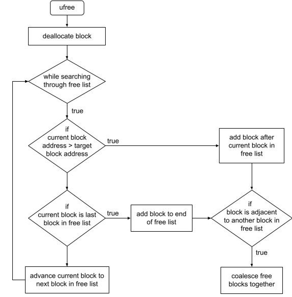

# Memory Manager

<!-- TABLE OF CONTENTS -->
<details>
  <summary>Table of Contents</summary>
  <ol>
    <li>
      <a href="#about-the-project">About The Project</a>
    </li>
    <li><a href="#structure">Structure</a></li>
    <li><a href="#approach/execution">Approach/Execution</a></li>
    <li><a href="#learning challenges">Learning Challenges</a></li>
    <li><a href="#contact">Contact</a></li>
  </ol>
</details>


 
<!-- ABOUT THE PROJECT -->
## About The Project

Dynamic storage allocator for C programs that is space-effiecient and has high-throughput.

* Mallocs an allocated block for the given size bytes within the heap region
* Implements first fit allocation and splits allocated blocks to reduce internal fragmentation
* Frees block associated with the given pointer 
* Coalesces contiguous free blocks in the free list to reduce external fragmentation

<!-- STRUCTURE -->
## Structure

The blocks in memory that are managed by the heap are represented as memory_block_struct

```
typedef struct memory_block_struct {
    size_t block_size_alloc; // size of block not including the header
    struct memory_block_struct *next; // points to next block in free list
} memory_block_t;
```
The blocks in memory that are unallocated are stored in a free list in address sorted order (larger address to smaller or vice versa???). 

Free list
* Singly linked list
* Holds all of the unallocated blocks that are within the heap
* Contains a free_head_block which is always the first element in the free list with a size of 0

```
// A pointer to the start of the free list.
memory_block_t *free_head;
```
Structure of umalloc ()


Structure of ufree ()



<!-- APPROACH/EXECUTION -->
## Approach/Execution

TODO: describe overall approach
TODO: describe testing that was done

TODO: include an overall block diagram of main program functions


<!-- LEARNING CHALLENGES -->
## Learning Challenges

The major problems that I encountered while programming/designing include:
* what to do if the head of the free list is allocated since the program keeps track of the free list by storing a pointer to the first block
* how to determine when blocks that are in the free list should be coallesced
* what type of allocation strategy to choose that would be both simple and time efficient

How I solved these problems:
* including a free_head_block in the free list which has a size of 0 and can never be allocated (makes accessing free list simpler and only wastes 16 bytes for header)
* making the free list sorted by address therefore if blocks on the free list are contiguous in memory they would be adjacent in the free list
* chose first fit since my free list is address ordered rather than ordered by size of blocks therefore is O(N)

<!-- CONTACT -->
## Contact

Lucy Mahlmann - lmahlmann@utexas.edu

Project Link: [https://github.com/lucy-mahlmann/MM-Lab-lucy-mahlmann](https://github.com/lucy-mahlmann/MM-Lab-lucy-mahlmann)

<p align="right">(<a href="#readme-top">back to top</a>)</p>

